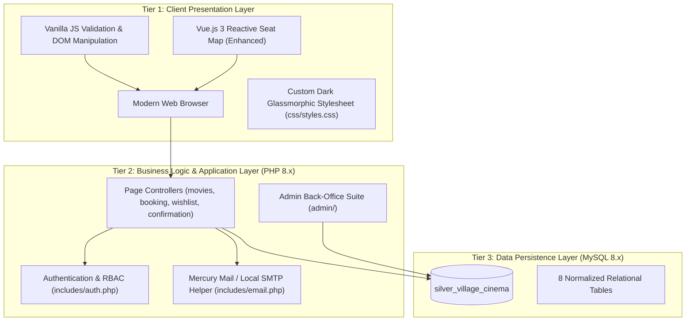
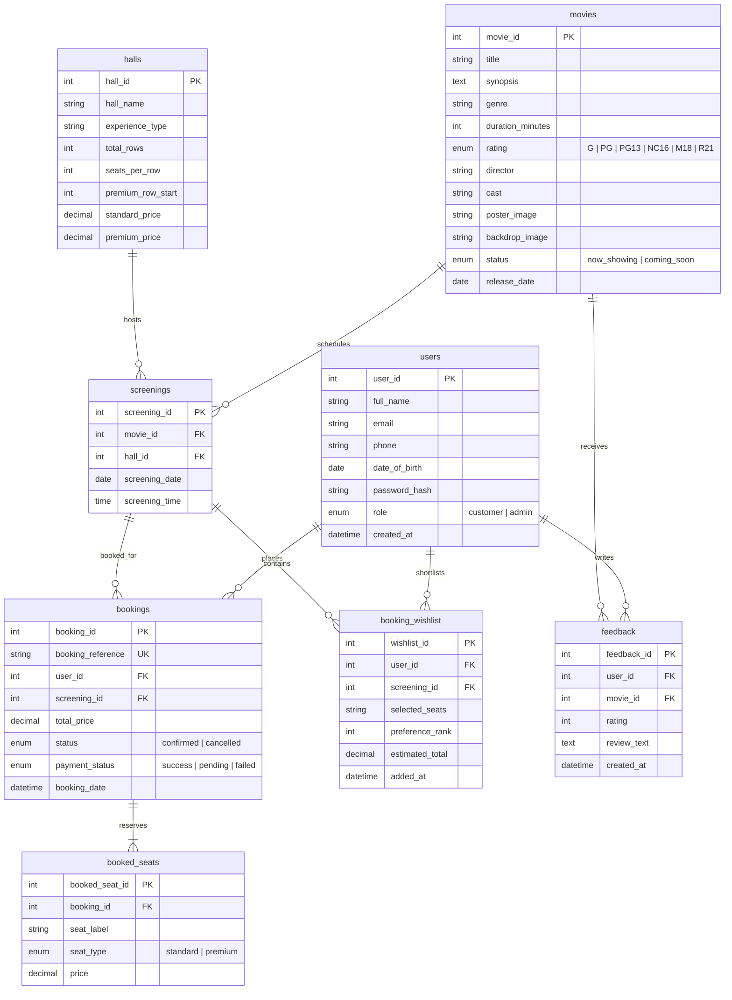

# 🎬 Silver Village Cinema — Web Application Design Project (IE4727)

> **Theme 5:** A web portal for booking cinema tickets  
> **Tagline:** *"Your Seat, Your Show, Your Way."*  
> **GitHub Repository:** [https://github.com/emocado/silver-village-cinema](https://github.com/emocado/silver-village-cinema)

---

## 📑 Table of Contents
1. [Beginner Quickstart: How to Run This App on Your Computer](#1-beginner-quickstart-how-to-run-this-app-on-your-computer)
2. [Project Overview & Core Problem Statement](#2-project-overview--core-problem-statement)
3. [Architectural Design & System Engineering](#3-architectural-design--system-engineering)
4. [Database Schema & Entity Relationship Diagram (ERD)](#4-database-schema--entity-relationship-diagram-erd)
5. [Email System & XAMPP Mercury Mail Integration](#5-email-system--xampp-mercury-mail-integration)
6. [Pre-configured Test Demo Accounts](#6-pre-configured-test-demo-accounts)
7. [Step-by-Step Presentation User Flows & Demo Script](#7-step-by-step-presentation-user-flows--demo-script)
8. [File & Directory Structure](#8-file--directory-structure)

---

## 1. 🚀 Beginner Quickstart: How to Run This App on Your Computer

*Never used GitHub or XAMPP before? Follow this simple step-by-step guide!*

---

### Step 1: Install XAMPP
1. Download and install **XAMPP for Windows** from [https://www.apachefriends.org/](https://www.apachefriends.org/) (use default installation settings, which installs to `C:\xampp`).

---

### Step 2: Get the Project Code

You can choose either **Option A** (Easiest - No command line) or **Option B** (Using Git):

#### Option A: Download as ZIP (Easiest for Beginners)
1. Go to the GitHub repository: [https://github.com/emocado/silver-village-cinema](https://github.com/emocado/silver-village-cinema)
2. Click the green **`<> Code`** button near the top right.
3. Click **Download ZIP**.
4. Unzip/Extract the downloaded folder.
5. Rename the extracted folder to `silver-village-cinema` and move it inside your XAMPP `htdocs` directory so the path is:
   ```
   C:\xampp\htdocs\silver-village-cinema
   ```

#### Option B: Clone using Git (If you have Git installed)
1. Open **Command Prompt** or **PowerShell** on your computer.
2. Run the following command:
   ```bash
   cd C:\xampp\htdocs
   git clone https://github.com/emocado/silver-village-cinema.git
   ```

---

### Step 3: Start XAMPP (Apache & MySQL)
1. Open the **XAMPP Control Panel** from your Windows Start Menu.
2. Click the **Start** button next to **Apache** (it will turn green).
3. Click the **Start** button next to **MySQL** (it will turn green).

---

### Step 4: Import the Database (`schema.sql`)
1. Open your web browser (Chrome, Edge, Firefox, etc.) and go to:
   ```
   http://localhost/phpmyadmin/
   ```
2. Click on the **Import** tab at the top of the page.
3. Click the **Choose File** (or Browse) button and select the database file located at:
   ```
   C:\xampp\htdocs\silver-village-cinema\sql\schema.sql
   ```
4. Scroll to the bottom of the page and click the **Import** (or **Go**) button.
5. You will see a green success message confirming that 8 tables and sample movie data were imported!

---

### Step 5: Open and Enjoy the Application!
Open your browser and navigate to:

| Web Portal | Browser Link | Description |
| :--- | :--- | :--- |
| 🍿 **Customer Web Portal** | [`http://localhost/silver-village-cinema/`](http://localhost/silver-village-cinema/) | Main homepage, movie catalog, showtimes table, booking, and wishlist |
| ⚡ **Vue.js Enhanced Seat Picker** | [`http://localhost/silver-village-cinema/enhanced/booking_enhanced.php`](http://localhost/silver-village-cinema/enhanced/booking_enhanced.php) | Modern reactive seat selection built with Vue 3 & Tailwind CSS |
| 📬 **Local Server Mailbox** | [`http://localhost/silver-village-cinema/mailbox.php`](http://localhost/silver-village-cinema/mailbox.php) | View all dispatched e-ticket confirmation receipts and QR codes |
| 🛡️ **Admin Dashboard** | [`http://localhost/silver-village-cinema/admin/`](http://localhost/silver-village-cinema/admin/) | Cinema revenue KPIs, movie CRUD, screening scheduler, bookings reports |

---

## 2. Project Overview & Core Problem Statement

Silver Village Cinema is an end-to-end cinema ticket booking portal developed to fulfill all requirements and design guidelines of **IE4727 Web Application Design**:

### 🎯 Core Problem Statement Fulfillment (Theme 5)
> *"A customer can make multiple bookings in order of his/her preferences. The list of available bookings will be presented to the customer for final selection of one or more bookings."*

* **Booking Wishlist & Ranking:** Rather than forcing customers into a single rigid booking path, customers can shortlist multiple showtimes and seats, assigning each a preference priority (**#1 Top Choice**, **#2 Alternative Option**, **#3 Backup Option**).
* **Dynamic Seat Conflict Detection:** The system performs live SQL conflict checks against `booked_seats` across all shortlisted showtimes, labeling each with real-time status badges (🟢 100% Available, 🟡 High Demand / Partially Available, 🔴 Unavailable).
* **Preference Hierarchy Reordering:** Customers can re-rank their choices using `[▲ / ▼]` controls, which updates the database via SQL `UPDATE` transactions.
* **Multi-Booking Consolidated Checkout:** Customers can select one or more available shortlisted bookings via checkboxes and confirm all tickets together in a single consolidated transaction.

---

## 3. Architectural Design & System Engineering

### 🏛️ 3-Tier Layered Architecture



### 🛡️ Security & Design Considerations
1. **Password Security:** Passwords are never stored in plaintext. Passwords are salted and hashed using BCrypt via PHP's `password_hash($pass, PASSWORD_DEFAULT)` and verified using constant-time `password_verify()`.
2. **SQL Injection Prevention:** 100% of dynamic database queries utilize MySQLi Prepared Statements with parameterized inputs (`$stmt->bind_param()`).
3. **Cross-Site Request Forgery (CSRF):** Form submissions generate and validate cryptographically secure tokens (`$_SESSION['csrf_token']`).
4. **Cross-Site Scripting (XSS):** All dynamic user and database outputs are escaped using `htmlspecialchars(..., ENT_QUOTES, 'UTF-8')`.
5. **Session Security:** PHP sessions regenerate IDs on privilege transitions and enforce role-based access checks (`requireLogin()`, `requireAdmin()`).
6. **Graceful Poster Fallbacks:** Real theatrical movie posters in `images/posters/` with CSS gradient fallbacks.

---

## 4. Database Schema & Entity Relationship Diagram (ERD)

### 📊 Entity Relationship Diagram



---

## 5. Email System & XAMPP Mercury Mail Integration

Per project guidelines, email notifications must remain confined to the local web server environment without communicating with external mail servers.

### 📬 How Email Delivery Works:

```
[ Customer Checkout ] ──▶ includes/email.php
                                │
                                ├──▶ 1. PHP mail() ──▶ localhost:25 (XAMPP Mercury Mail Server)
                                ├──▶ 2. Web Mailbox Viewer ──▶ http://localhost/silver-village-cinema/mailbox.php
                                └──▶ 3. Permanent File Archive ──▶ /sent_emails/booking_[REF].html
```

#### 1. XAMPP Mercury Mail Server (SMTP `localhost:25`)
* XAMPP includes **Mercury Mail Server** (the 4th module on the XAMPP Control Panel).
* When Mercury is started, it acts as the local SMTP server on port 25.
* PHP's `mail()` sends the raw message stream to Mercury.
* Mercury stores raw email queue files with extensions like `.CNM` (Core Net Message) or `.MBX` in `C:\xampp\MercuryMail\MAIL\Admin\` or `C:\xampp\MercuryMail\QUEUE\`.

#### 2. Built-in Web Mailbox Viewer (`mailbox.php`) — *Recommended for Demo!*
* Because raw `.CNM` files in Mercury are unrendered text streams, the application includes a dedicated **Local Mailbox Viewer** at:
  ```
  http://localhost/silver-village-cinema/mailbox.php
  ```
* On the checkout confirmation page, clicking **`[✉️ View Email in Local Mailbox &rarr;]`** instantly displays the fully formatted HTML email with cinema branding, booking reference, screening breakdown, pricing, and scannable QR code.

#### 3. Permanent File Archive (`/sent_emails/`)
* Every sent email is also archived as a clean `.html` file inside `sent_emails/booking_[REF].html` for persistent offline evaluation.

---

## 6. Pre-configured Test Demo Accounts

| Role | Email Address | Password | Description |
| :--- | :--- | :--- | :--- |
| **Customer** | `user@silvervillage.local` | `Pass1234!` | Pre-seeded with active preference wishlist items and bookings |
| **Customer 2** | `sarah@silvervillage.local` | `Pass1234!` | Additional customer for testing reviews and seat conflicts |
| **Administrator** | `admin@silvervillage.local` | `Admin123!` | Access to the back-office admin dashboard and management tools |

---

## 7. Step-by-Step Presentation User Flows & Demo Script

Follow this structured workflow during your project presentation to demonstrate how every requirement is met:

---

### 🔹 Flow 1: User Registration & Client/Server Validation (`register.php`)
1. Click **Register** on the navigation bar.
2. **Showcase Validation Rules (Project Requirement):**
   * Submit blank form &rarr; observe inline error states.
   * Enter invalid Singapore phone (`12345`) &rarr; observe 8-digit SG format enforcement (`[689]XXXXXXX`).
   * Enter birth date under 13 years old &rarr; observe minimum age check.
   * Type weak password (`abc`) &rarr; observe dynamic color-coded **Password Strength Meter** update in real time.
3. **Complete Registration:**
   * Enter valid details (`david@silvervillage.local` / `Pass1234!`), check Terms, and submit.
   * Verify instant database insertion and automatic session login.

---

### 🔹 Flow 2: Movie Catalog & Dynamic Showtimes Table (`movies.php` & `movie_details.php`)
1. Click **Movies** (`movies.php`).
2. **Showcase Server-Side Generation & Filtering (Project Requirement):**
   * Filter by *Now Showing* or *Coming Soon*, or filter by Genre (*Action*, *Sci-Fi*).
   * Point out the high-resolution movie posters (Spider-Man: Brand New Day, The Odyssey, Insidious, etc.).
3. Click on **Spider-Man: Brand New Day** (`movie_details.php`).
4. **Showcase the Content Table (Project Requirement):**
   * Highlight the **Showtimes Schedule Matrix Table** across Hall A (Dolby Atmos), Hall B (VIP), Hall C (Standard).
   * Point out the live seat availability count badges (e.g. *38 / 60 Available*).

---

### 🔹 Flow 3: The Core Theme 5 Multi-Booking Preference Shortlisting (`booking.php` & `wishlist.php`)
*(The core requirement of the course project)*

1. **Shortlist Choice #1:**
   * In *Spider-Man: Brand New Day*, click **Select Seats** for today's 7:30 PM show in Hall A.
   * Select seats `D3` and `D4` (Premium Recliners) &rarr; seats glow gold, subtotal calculates to \$29.00.
   * Set dropdown to **Preference #1 (Top Choice)**.
   * Click **"📋 Add to Booking Wishlist"** &rarr; saved to MySQL; redirected to Wishlist.
2. **Shortlist Choice #2 (Alternative):**
   * Go back to Movies, click *The Odyssey*, select tomorrow's 9:00 PM show in Hall B.
   * Pick seats `E5` and `E6`, set **Preference #2 (Alternative Option)**, and add to Wishlist.
3. **Shortlist Choice #3 (Backup):**
   * Go to Movies, click *Insidious: Out of the Further*, pick 9:30 PM in Hall C, seats `C4` and `C5`.
   * Set **Preference #3 (Backup Option)**, and add to Wishlist.
4. **Showcase Wishlist Management (`wishlist.php`):**
   * Highlight all 3 shortlisted choices arranged in order of preference with visual badges.
   * **Demonstrate Live Seat Conflict Checking:** Show real-time status badges (🟢 100% Available vs 🔴 Taken).
   * **Demonstrate Reordering:** Click `▲` on Preference #2 &rarr; watch the SQL `UPDATE` transaction swap ranking positions live.
   * **Multi-Select Checkout:** Check Choice #1 and Choice #3 &rarr; sticky summary computes combined total (\$50.00).
   * Click **"Confirm & Proceed to Payment"**.

---

### 🔹 Flow 4: Confirmation, E-Tickets & Payment Simulation (`confirmation.php`)
1. View the issued digital boarding pass e-tickets with booking reference (`#SVC-2026-XXXX`) and QR codes.
2. **Demonstrate Payment Simulation:**
   * Click **"Simulate Payment Failure Flow"** &rarr; status updates to *Cancelled*, seats are released back to inventory.
   * Re-book to demonstrate successful transaction.

---

### 🔹 Flow 5: Local Email Acknowledgement (`mailbox.php`)
1. Click **`[✉️ View Email in Local Mailbox &rarr;]`** on the confirmation page (or in *My Bookings*).
2. Inspect the official HTML e-ticket receipt dispatched to the customer's email address.

---

### 🔹 Flow 6: Verified Customer Reviews (`feedback.php`)
1. Click **Feedback** on the top menu.
2. Select a movie from the dropdown, choose a 5-star rating, write a review, and submit.
3. Show the review instantly appearing on both the feedback board and the movie's detail page.

---

### 🔹 Flow 7: Back-Office Administrator Suite (`/admin/`)
1. Log in with `admin@silvervillage.local` / `Admin123!`.
2. Click **⚡ Admin** on the navigation bar:
   * **Dashboard (`admin/index.php`):** View real-time revenue KPIs and booking stats.
   * **Manage Movies (`admin/manage_movies.php`):** Demonstrate Movie CRUD (Add/Edit/Delete titles).
   * **Screening Scheduler (`admin/manage_screenings.php`):** Schedule new showtimes across auditoriums.
   * **Bookings Report (`admin/view_bookings.php`):** Server-side generated report with date and status filters.

---

### 🔹 Flow 8: Additional Version (15% Modern Enhancements)
1. Navigate to: [`http://localhost/silver-village-cinema/enhanced/booking_enhanced.php`](http://localhost/silver-village-cinema/enhanced/booking_enhanced.php).
2. Demonstrate **Vue.js 3 reactivity** with instant seat selection, live price counter, and utility-first **Tailwind CSS** styling.

---

## 8. File & Directory Structure

```
silver-village-cinema/
├── index.php                  # Homepage with hero & featured movies
├── movies.php                 # Dynamic server-side movie catalog & search
├── movie_details.php          # Movie synopsis & showtimes table
├── register.php               # 6-field registration form with JS/PHP validation
├── login.php                  # Member login authentication
├── logout.php                 # Session destroy handler
├── booking.php                # Seat map, pricing tiers & preference rank selector
├── wishlist.php               # Multi-booking preference management & checkout
├── confirmation.php           # Confirmation, e-tickets & payment simulation
├── my_bookings.php            # Booking history table & cancellation
├── feedback.php               # Customer rating & reviews system
├── about.php                  # Cinema specs & contact enquiry form
├── mailbox.php                # Local server mailbox viewer for e-tickets
├── css/
│   └── styles.css             # Master external stylesheet (50+ custom rules)
├── js/
│   └── validation.js          # Client-side form validation script
├── images/
│   ├── hero_spiderman.jpg     # Spider-Man wide hero background image
│   ├── logo.png               # Brand logo
│   └── posters/               # 10 High-Resolution Theatrical Movie Posters
│       ├── spiderman.jpg      # Spider-Man: Brand New Day
│       ├── odyssey.jpg        # The Odyssey
│       ├── insidious.jpg      # Insidious: Out of the Further
│       ├── oak_street.jpg     # The End of Oak Street
│       ├── dog_stars.jpg      # The Dog Stars
│       ├── minions.jpg        # Minions & Monsters
│       ├── toystory5.jpg      # Toy Story 5
│       ├── coyote.jpg         # Coyote vs. Acme
│       ├── practical_magic.jpg# Practical Magic 2
│       └── resident_evil.jpg  # Resident Evil: Biohazard Redux
├── includes/
│   ├── db_connect.php         # MySQLi database connection
│   ├── auth.php               # Authentication & session helpers
│   ├── email.php              # Local email dispatch & HTML archiving
│   ├── header.php             # Shared navigation & dynamic page titles
│   └── footer.php             # Shared cinema footer
├── admin/
│   ├── index.php              # Admin KPI operations dashboard
│   ├── manage_movies.php      # Movie CRUD management
│   ├── manage_screenings.php  # Auditorium showtime scheduler
│   └── view_bookings.php      # Server-side generated bookings report
├── enhanced/
│   └── booking_enhanced.php   # Vue.js 3 + Tailwind CSS modern seat picker
├── sent_emails/               # Local archive directory for all sent e-ticket emails
├── sql/
│   └── schema.sql             # MySQL schema & pre-seeded data
└── README.md                  # Comprehensive documentation & beginner setup guide
```
