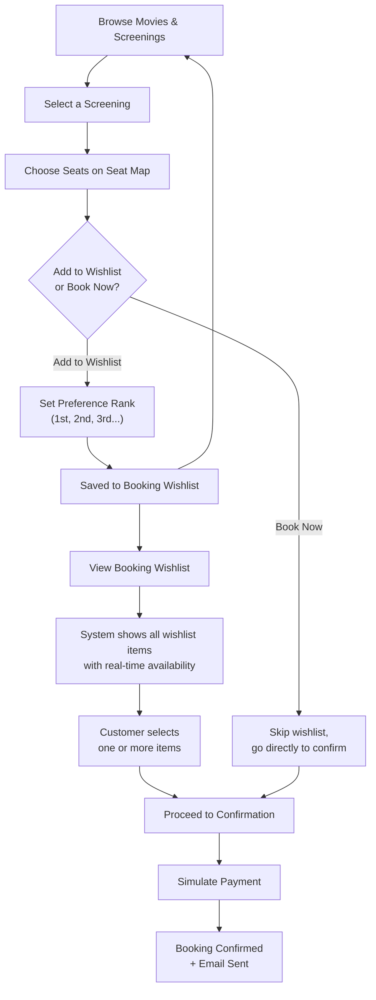
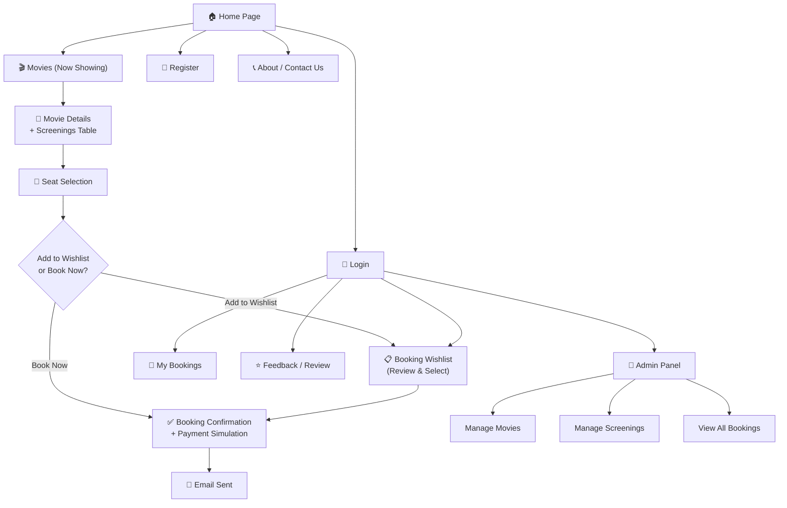
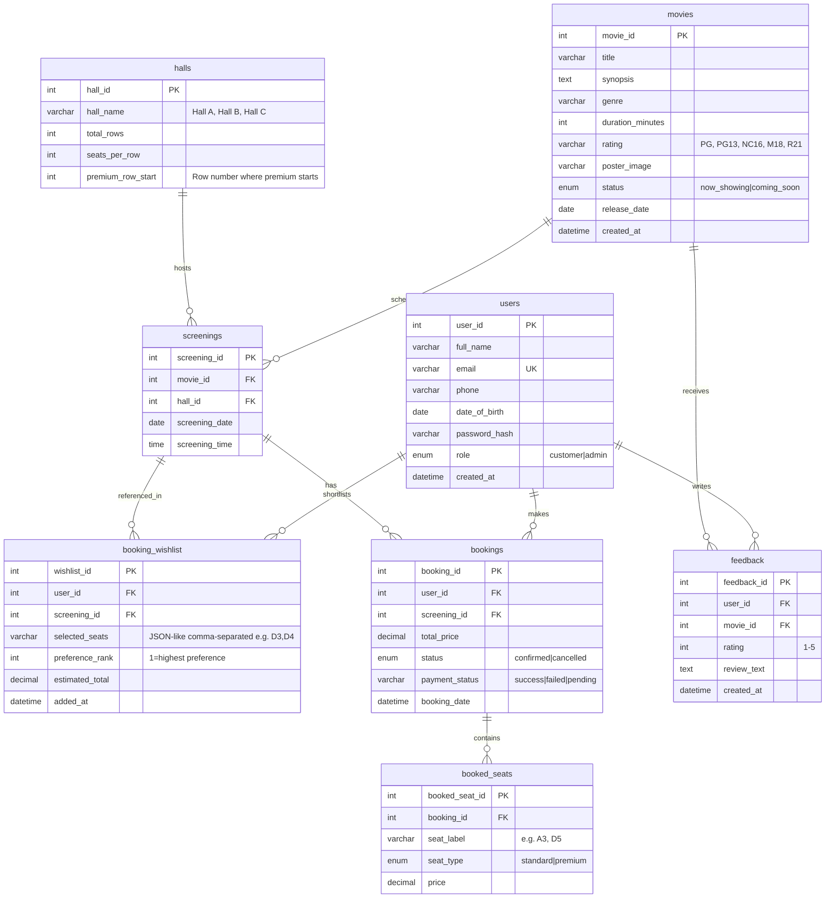

# Silver Village Cinema Booking System — Implementation Plan

## Project Overview

**Theme:** Theme 5 — A web portal for booking cinema tickets  
**Title:** Silver Village Cinema Booking System  
**Tagline:** "Your Seat, Your Show, Your Way."

Silver Village Cinema is a web-based cinema ticket booking system that allows customers to browse currently-showing and upcoming movies, view screening schedules, select seats, and book tickets online. The system supports a **multi-booking preference workflow** where customers can shortlist multiple potential bookings ranked by preference before making a final selection. Upon confirmation, the system sends an email acknowledgement with booking details.

The project is built using the **traditional stack** (HTML, CSS, JavaScript, PHP, MySQL) for the Base Version (85%) and enhanced with **Vue.js + Tailwind CSS** for the Additional Version (15%).

---

## Assumptions

1. **Cinema Details:** Silver Village Cinema is a single-location cinema with **3 screening halls** (Hall A: 60 seats, Hall B: 80 seats, Hall C: 100 seats).
2. **Seat Layout:** Seats are arranged in a grid (rows × columns). Each hall has a fixed layout. Seats are categorized as Standard and Premium (front rows = standard, back rows = premium with higher price).
3. **Movies:** The cinema uses **real currently-screening movies** (see Movie Data section below).
4. **Pricing:** Standard seat: \$10.50, Premium seat: \$14.50. No dynamic pricing.
5. **Payment:** Payment is handled by a third-party portal (not implemented). We simulate a "payment successful" or "payment failed" flow with a simple confirmation page.
6. **Email:** Emails are sent using PHP `mail()` configured with **XAMPP's Mercury Mail** (local SMTP) — sent only to the user's own local web server email account as per project rules.
7. **User Accounts:** Customers must register and log in to book tickets. Guest browsing of movies/schedules is allowed.
8. **Booking Rules:** A customer can add multiple potential bookings to a **Booking Wishlist** ranked by preference, review them all at once, then confirm one or more. The system prevents double-booking of seats.
9. **Admin Panel:** A simple admin interface for managing movies, screenings, and viewing bookings (serves as the "server-side generated web page" requirement).
10. **No external libraries** like jQuery, Bootstrap, AJAX, or JSON in the Base Version.
11. **Local Environment:** XAMPP (Apache + MySQL + PHP) on Windows.

---

## Movie Data (Real Currently-Screening Movies)

### Now Showing
| # | Title | Genre | Duration | Rating |
|---|-------|-------|----------|--------|
| 1 | Spider-Man: Brand New Day | Action / Sci-Fi | 148 min | PG13 |
| 2 | The Odyssey | Adventure / Drama | 163 min | PG |
| 3 | Insidious: Out of the Further | Horror / Thriller | 105 min | NC16 |
| 4 | The End of Oak Street | Sci-Fi / Mystery | 120 min | PG13 |
| 5 | Minions & Monsters | Animation / Comedy | 95 min | PG |
| 6 | The Dog Stars | Drama / Post-Apocalyptic | 132 min | M18 |
| 7 | Toy Story 5 | Animation / Family | 100 min | PG |
| 8 | Coyote vs. Acme | Comedy / Animation | 98 min | PG |

### Coming Soon
| # | Title | Genre | Duration | Rating |
|---|-------|-------|----------|--------|
| 9 | Practical Magic 2 | Fantasy / Comedy | 115 min | PG13 |
| 10 | Resident Evil | Action / Horror | 110 min | M18 |

> [!NOTE]
> Movie poster images will be placeholder images (solid color with title text overlay) since we cannot use copyrighted promotional material. The admin panel allows uploading custom poster images if desired.

---

## Multi-Booking Preference Workflow — Design & Interpretation

> [!IMPORTANT]
> **Project Requirement:** *"A customer can make multiple bookings in order of his/her preferences. The list of available bookings will be presented to the customer for final selection of one or more bookings."*

### My Interpretation

The project description describes a **two-phase booking process** that differs from a typical "book one ticket immediately" flow:

**Phase 1 — Shortlisting (Add to Booking Wishlist):**
The customer browses movies and screenings and, instead of immediately confirming a booking, **adds potential bookings to a "Booking Wishlist"**. Each wishlist entry represents a screening + selected seats that the customer is *interested in* but hasn't committed to yet. The customer assigns a **preference rank** (1st choice, 2nd choice, etc.) to each wishlist entry.

For example, a customer might add:
- **Preference 1:** Spider-Man: Brand New Day — Sat 30 Aug, 7:30 PM, Hall A, Seats D3, D4
- **Preference 2:** The Odyssey — Sat 30 Aug, 9:00 PM, Hall B, Seats E5, E6
- **Preference 3:** Spider-Man: Brand New Day — Sun 31 Aug, 3:00 PM, Hall A, Seats C1, C2

**Phase 2 — Review & Final Selection:**
When the customer is ready, they visit the **Booking Wishlist page**. The system presents all their shortlisted bookings in preference order, with **real-time availability** shown (seats may have been taken by other users since they were added). The customer then:
1. Reviews the list
2. **Selects one or more** wishlist items to confirm
3. Proceeds to payment for the selected bookings
4. Unselected wishlist items are automatically cleared

This workflow makes sense for cinema booking because:
- A customer may be deciding between multiple movies or showtimes
- They can "hold" their preferred options while they browse further
- They see a consolidated view before committing money
- It mirrors how people actually plan cinema outings — "I'd like to see Movie A at 7pm, but if that doesn't work, Movie B at 9pm"

### How Seats Are Handled

- **While in the wishlist:** Seats are **NOT reserved** — they remain available to other customers. This is intentional; the wishlist is a preference list, not a cart with a hold.
- **Availability check at review time:** When the customer views the wishlist, the system checks if the selected seats are still available and displays a status badge:
  - 🟢 **Available** — all seats still free
  - 🟡 **Partially Available** — some seats taken, customer can modify
  - 🔴 **Unavailable** — all seats taken, customer must reselect
- **On confirmation:** Seats are booked atomically. If a seat was taken between the review and confirmation, the system alerts the customer and asks them to reselect.

### Flow Diagram



---

## Application Requirements

| Requirement      | Description |
|------------------|-------------|
| **Usability**    | Intuitive navigation with clear CTAs. The two-phase booking flow is guided with visual cues. Users can book in ≤6 clicks from the homepage. |
| **Responsiveness** | The site must render properly on desktop browsers (mobile responsiveness is a bonus via Tailwind in enhanced version). |
| **Security**     | Passwords hashed with `password_hash()`. SQL injection prevented via prepared statements. Session-based authentication. Input sanitization on all forms. CSRF tokens on all forms. |
| **Scalability**  | Normalized database schema (8 tables). Separation of concerns (PHP logic vs. HTML presentation). |
| **Maintainability** | External CSS stylesheet. Shared PHP includes. Consistent file/folder structure. Commented code. |
| **Accessibility** | Semantic HTML elements. Alt text on all images. Proper form labels and ARIA attributes where applicable. |

---

## Functional Requirements

### Customer-Facing

| ID   | Feature | Description |
|------|---------|-------------|
| F1   | Browse Movies | View all currently showing and upcoming movies with poster, synopsis, genre, duration, rating. |
| F2   | View Screenings | See screening schedule (date, time, hall) for a selected movie. |
| F3   | User Registration | Register with name, email, phone, DOB, password, confirm password. Client + server validation. |
| F4   | User Login/Logout | Secure session-based login/logout. |
| F5   | Seat Selection | Visual seat map for a selected screening. Pick one or more seats. Real-time availability display. |
| F6   | **Add to Booking Wishlist** | After seat selection, option to add to wishlist with a preference rank instead of booking immediately. |
| F7   | **View Booking Wishlist** | Consolidated list of all wishlist items in preference order. Real-time seat availability shown. Select one or more to confirm. Reorder or remove items. |
| F8   | Booking Confirmation | Review booking summary (movie, date, time, hall, seats, total price). Simulate payment (success/fail). |
| F9   | Email Acknowledgement | Send booking confirmation email with booking ID, movie, seats, date/time, total price via Mercury Mail. |
| F10  | Booking History | View past bookings with status (Confirmed / Cancelled). |
| F11  | Customer Feedback | Submit a rating (1–5) and text review for a movie. |

### Admin-Facing

| ID   | Feature | Description |
|------|---------|-------------|
| A1   | Admin Login | Separate admin login with elevated privileges. |
| A2   | Manage Movies | Add, edit, delete movies (title, synopsis, genre, duration, rating, poster, status). |
| A3   | Manage Screenings | Add screenings (movie, hall, date, time). View/delete screenings. |
| A4   | View Bookings | View all bookings with filters. Server-side generated page with dynamic data from DB. |

---

## Storyboard / Site Map



---

## Page Inventory

| # | Page | File | Dynamic Content | Key Requirement Met |
|---|------|------|-----------------|---------------------|
| 0 | **Home Page** | `index.php` | Featured movies from DB, "Now Showing" cards, "Coming Soon" preview | Home page ✅ |
| 1 | **Movies** | `movies.php` | All movie cards fetched from DB, filter by genre/status | Content page ✅, Server-side generated ✅ |
| 2 | **Movie Details** | `movie_details.php` | Movie info + screenings schedule **table** + reviews | Content page ✅, Table ✅ |
| 3 | **Register** | `register.php` | Registration **form** (6 fields), PHP validation, DB insert | Content page ✅, Form (6 fields) ✅ |
| 4 | **Login** | `login.php` | Login form, session management | Content page ✅ |
| 5 | **Seat Selection** | `booking.php` | Seat grid from DB, seat status, booking/wishlist actions | Content page ✅, DB Select/Insert ✅ |
| 6 | **Booking Wishlist** | `wishlist.php` | Wishlist items with availability, preference ranking, multi-select confirm | Content page ✅, **Multi-booking preference** ✅ |
| 7 | **Booking Confirmation** | `confirmation.php` | Booking summary, payment simulation, email trigger | Content page ✅, Email ✅ |
| 8 | **My Bookings** | `my_bookings.php` | Booking history **table** from DB | Content page ✅, Table ✅ |
| 9 | **Feedback** | `feedback.php` | Feedback form + existing reviews display | Content page ✅ |
| 10 | **About / Contact** | `about.php` | Cinema info, contact form | Content page ✅ |

**Total: 1 home page + 10 content pages = 11 pages** (adjusted from 10 — the wishlist page is the new addition; still within the max of 11)

> [!NOTE]
> The admin pages (`admin/index.php`, `admin/manage_movies.php`, `admin/manage_screenings.php`, `admin/view_bookings.php`) are additional internal management pages and not counted toward the customer-facing page count.

---

## Wireframe: Booking Wishlist Page (`wishlist.php`)

This is the new key page that fulfils the multi-booking preference requirement.

```
┌──────────────────────────────────────────────────────────────┐
│  LOGO    [Movies] [Wishlist (3)] [My Bookings] [Logout]      │
├──────────────────────────────────────────────────────────────┤
│                                                              │
│  📋 YOUR BOOKING WISHLIST                                    │
│  Review your shortlisted bookings and confirm your picks.    │
│                                                              │
│  ┌─ ☐ ── Preference #1 ─────────────────────────────────┐   │
│  │  🎬 Spider-Man: Brand New Day                         │   │
│  │  📅 Sat 30 Aug 2026  ⏰ 7:30 PM  🎭 Hall A           │   │
│  │  💺 Seats: D3, D4 (Premium)                           │   │
│  │  💰 Total: $29.00                                     │   │
│  │  Status: 🟢 Available                                 │   │
│  │  [↓ Move Down]  [✏️ Change Seats]  [🗑 Remove]        │   │
│  └───────────────────────────────────────────────────────┘   │
│                                                              │
│  ┌─ ☐ ── Preference #2 ─────────────────────────────────┐   │
│  │  🎬 The Odyssey                                       │   │
│  │  📅 Sat 30 Aug 2026  ⏰ 9:00 PM  🎭 Hall B           │   │
│  │  💺 Seats: E5, E6 (Premium)                           │   │
│  │  💰 Total: $29.00                                     │   │
│  │  Status: 🟡 Partially Available (E5 taken)            │   │
│  │  [↑ Move Up]  [↓ Move Down]  [✏️ Change Seats]  [🗑]  │   │
│  └───────────────────────────────────────────────────────┘   │
│                                                              │
│  ┌─ ☐ ── Preference #3 ─────────────────────────────────┐   │
│  │  🎬 Spider-Man: Brand New Day                         │   │
│  │  📅 Sun 31 Aug 2026  ⏰ 3:00 PM  🎭 Hall A           │   │
│  │  💺 Seats: C1, C2 (Standard)                          │   │
│  │  💰 Total: $21.00                                     │   │
│  │  Status: 🟢 Available                                 │   │
│  │  [↑ Move Up]  [✏️ Change Seats]  [🗑 Remove]          │   │
│  └───────────────────────────────────────────────────────┘   │
│                                                              │
│  ─────────────────────────────────────────────────────────   │
│  Selected: 0 bookings | Grand Total: $0.00                   │
│                                                              │
│  [ Confirm Selected Bookings → ]          [ Clear Wishlist ] │
│                                                              │
├──────────────────────────────────────────────────────────────┤
│  Footer                                                      │
└──────────────────────────────────────────────────────────────┘
```

---

## Wireframe: Seat Selection Page (`booking.php`)

Updated to include the "Add to Wishlist" option alongside "Book Now".

```
┌──────────────────────────────────────────────────────────────┐
│  Nav Bar                                                     │
├──────────────────────────────────────────────────────────────┤
│  🎬 Spider-Man: Brand New Day | Hall A | Sat 30 Aug, 7:30 PM│
├──────────────────────────────────────────────────────────────┤
│              ┌────── SCREEN ──────┐                          │
│                                                              │
│   Row A:  [1][2][3][4][5][6][7][8][9][10]   ← Standard      │
│   Row B:  [1][2][3][4][5][6][7][8][9][10]                    │
│   Row C:  [1][2][3][4][5][6][7][8][9][10]                    │
│   Row D:  [1][2][3][4][5][6][7][8][9][10]   ← Premium       │
│   Row E:  [1][2][3][4][5][6][7][8][9][10]                    │
│   Row F:  [1][2][3][4][5][6][7][8][9][10]                    │
│                                                              │
│   Legend: 🟩 Available  🟥 Booked  🟦 Selected               │
│                                                              │
│   Selected: D3, D4 (Premium)     Total: $29.00               │
│                                                              │
│   Preference Rank: [ 1st Choice ▼ ]  (for wishlist)          │
│                                                              │
│   [ 📋 Add to Wishlist ]        [ ✅ Book Now → ]            │
│                                                              │
├──────────────────────────────────────────────────────────────┤
│  Footer                                                      │
└──────────────────────────────────────────────────────────────┘
```

---

## Wireframe: Other Key Pages

### Home Page (`index.php`)
```
┌──────────────────────────────────────────────────────────────┐
│  🎬 SILVER VILLAGE   [Movies] [Wishlist] [Login] [Register]  │
├──────────────────────────────────────────────────────────────┤
│                                                              │
│         ★ HERO BANNER: Spider-Man: Brand New Day ★           │
│         "Now Showing at Silver Village Cinema"               │
│         [View Screenings →]                                  │
│                                                              │
├──────────────────────────────────────────────────────────────┤
│  NOW SHOWING                                                 │
│  ┌──────┐ ┌──────┐ ┌──────┐ ┌──────┐                       │
│  │Poster│ │Poster│ │Poster│ │Poster│                        │
│  │Title │ │Title │ │Title │ │Title │                        │
│  │Genre │ │Genre │ │Genre │ │Genre │                        │
│  │[View]│ │[View]│ │[View]│ │[View]│                        │
│  └──────┘ └──────┘ └──────┘ └──────┘                       │
│                              ... more cards ...              │
├──────────────────────────────────────────────────────────────┤
│  COMING SOON                                                 │
│  ┌──────┐ ┌──────┐                                          │
│  │Poster│ │Poster│                                           │
│  │Title │ │Title │                                           │
│  └──────┘ └──────┘                                          │
├──────────────────────────────────────────────────────────────┤
│  Footer: © 2026 Silver Village Cinema                        │
└──────────────────────────────────────────────────────────────┘
```

### Registration Form (`register.php`)
```
┌──────────────────────────────────────────────────────────────┐
│  Nav Bar                                                     │
├──────────────────────────────────────────────────────────────┤
│  CREATE YOUR ACCOUNT                                         │
│                                                              │
│  Full Name:         [____________________________]           │
│  Email:             [____________________________]           │
│  Phone:             [____________________________]           │
│  Date of Birth:     [____________________________]           │
│  Password:          [____________________________]           │
│  Confirm Password:  [____________________________]           │
│                                                              │
│                    [ Register → ]                             │
│                                                              │
│  Already have an account? [Login here]                       │
├──────────────────────────────────────────────────────────────┤
│  Footer                                                      │
└──────────────────────────────────────────────────────────────┘
```

---

## Database Schema



> [!NOTE]
> The `booking_wishlist` table is the key addition that enables the multi-booking preference workflow. It stores tentative bookings with preference rankings. The `selected_seats` column stores a comma-separated list of seat labels (e.g., "D3,D4"). This is intentionally not normalized further because wishlist items are temporary and frequently deleted — the overhead of a join table is not warranted. Once a wishlist item is confirmed, the seats are properly stored in the normalized `booked_seats` table.

**Total: 8 tables** (7 from original + 1 new `booking_wishlist`)

---

## Technology Stack

### Base Version (85%)

| Layer | Technology | Notes |
|-------|-----------|-------|
| Server | XAMPP (Apache 2.4 + PHP 8.x + MySQL 8.x) | Local development on Windows |
| Frontend | HTML5, CSS3, Vanilla JavaScript | No jQuery, no Bootstrap, no frameworks |
| Backend | PHP 8.x | Server-side scripting, form processing, session management |
| Database | MySQL 8.x (via MySQLi) | Prepared statements throughout |
| Email | PHP `mail()` via XAMPP Mercury Mail | Local SMTP, emails to local mailbox only |
| Styling | External CSS (`css/styles.css`) | Custom dark cinema theme, 40+ rules |
| Validation | JS (client-side) + PHP (server-side) | HTML5 attributes + custom JS + PHP fallback |

### Additional Version (15%)

| Layer | Technology | Notes |
|-------|-----------|-------|
| Frontend Framework | Vue.js 3 (via CDN) | Interactive seat selection + wishlist component |
| CSS Framework | Tailwind CSS (via CDN) | Utility-first modern styling |
| Enhancements | Reactive seat picker, animated transitions, live wishlist summary | Replaces static PHP seat grid with Vue reactivity |

---

## Project File Structure

```
silver-village-cinema/
├── index.php                  # Home page
├── movies.php                 # Now Showing / Coming Soon listing
├── movie_details.php          # Individual movie + screenings table
├── register.php               # User registration (6-field form)
├── login.php                  # User login
├── logout.php                 # Logout handler
├── booking.php                # Seat selection → Add to Wishlist OR Book Now
├── wishlist.php               # ★ Booking Wishlist — review, reorder, confirm
├── confirmation.php           # Booking confirmation + payment sim + email
├── my_bookings.php            # Booking history
├── feedback.php               # Customer reviews/feedback
├── about.php                  # About us / Contact
├── css/
│   └── styles.css             # External stylesheet (dark cinema theme)
├── js/
│   └── validation.js          # Client-side form validation
├── images/
│   ├── logo.png               # Cinema logo
│   ├── hero-banner.jpg        # Home page hero
│   └── posters/               # Movie poster images (placeholders)
│       ├── spiderman.jpg
│       ├── odyssey.jpg
│       ├── insidious.jpg
│       └── ...
├── includes/
│   ├── db_connect.php         # MySQLi connection (prepared statements)
│   ├── header.php             # Shared nav bar (dynamic login state)
│   ├── footer.php             # Shared footer
│   ├── auth.php               # Session helpers, CSRF tokens
│   └── email.php              # Booking confirmation email helper
├── admin/
│   ├── index.php              # Admin dashboard
│   ├── manage_movies.php      # CRUD for movies
│   ├── manage_screenings.php  # CRUD for screenings
│   └── view_bookings.php      # Server-side generated bookings page
├── sql/
│   └── schema.sql             # Full DB schema + seed data (real movies)
└── enhanced/                  # Additional Version
    ├── booking_enhanced.php   # Vue.js interactive seat picker
    └── css/
        └── tailwind-custom.css
```

---

## Proposed Changes (Component-by-Component)

### Component 1: Database Layer

#### [NEW] [schema.sql](file:///c:/Users/weikh/projects/silver-village-cinema/sql/schema.sql)
- `CREATE DATABASE silver_village_cinema;`
- All **8 tables** as per ER diagram (including `booking_wishlist`)
- Seed data:
  - 3 halls (A: 6×10=60 seats, B: 8×10=80 seats, C: 10×10=100 seats)
  - 10 real movies (8 now showing + 2 coming soon)
  - 30+ screenings across the next 2 weeks
  - 1 admin user (`admin@silvervillage.local`), 2 test customers
- Foreign key constraints with `ON DELETE CASCADE`

#### [NEW] [db_connect.php](file:///c:/Users/weikh/projects/silver-village-cinema/includes/db_connect.php)
- MySQLi connection with error handling
- Charset set to `utf8mb4`
- Connection parameters for XAMPP defaults (`localhost`, `root`, `""`, `silver_village_cinema`)

---

### Component 2: Shared Includes

#### [NEW] [header.php](file:///c:/Users/weikh/projects/silver-village-cinema/includes/header.php)
- Dynamic `<title>` via parameter
- Navigation: Home, Movies, Wishlist (with count badge), My Bookings, Login/Register or Logout
- Admin link visible only for `role = 'admin'`

#### [NEW] [footer.php](file:///c:/Users/weikh/projects/silver-village-cinema/includes/footer.php)
- Copyright, cinema address, operating hours

#### [NEW] [auth.php](file:///c:/Users/weikh/projects/silver-village-cinema/includes/auth.php)
- `session_start()`, `isLoggedIn()`, `isAdmin()`, `requireLogin()`, `requireAdmin()`
- CSRF token generation (`bin2hex(random_bytes(32))`) and validation

#### [NEW] [email.php](file:///c:/Users/weikh/projects/silver-village-cinema/includes/email.php)
- `sendBookingConfirmation($bookingId, $userEmail, $details)` — HTML email via `mail()`
- Configured for XAMPP Mercury Mail (localhost SMTP)

---

### Component 3: Frontend Styling

#### [NEW] [styles.css](file:///c:/Users/weikh/projects/silver-village-cinema/css/styles.css)
- **Color scheme:** Dark cinema theme — `#0a0e17` (deep navy) background, `#d4af37` (gold) accents, `#f5f5f5` (off-white) text
- **Global:** body, typography (system font stack), links, transitions
- **Layout:** CSS Grid for movie cards, Flexbox for nav/footer, max-width containers
- **Components:** `.movie-card`, `.seat`, `.seat--available`, `.seat--booked`, `.seat--selected`, `.seat--premium`, `.wishlist-card`, `.btn`, `.btn--primary`, `.btn--secondary`, `.alert`, `.table`
- **Forms:** styled inputs, labels, error messages, focus states
- Minimum 4 styles → targeting 50+ rules

---

### Component 4: Client-Side Validation

#### [NEW] [validation.js](file:///c:/Users/weikh/projects/silver-village-cinema/js/validation.js)
- **Registration:** name (letters/spaces), email (regex), phone (8-digit SG), DOB (past date, age ≥ 13), password (8+ chars, 1 upper, 1 digit), confirm match
- **Feedback:** rating selected, review ≥ 10 chars
- **Booking:** ≥ 1 seat selected
- **Contact form:** all fields required, valid email
- Inline error messages, real-time validation on blur

---

### Component 5: Core Customer Pages

#### [NEW] [index.php](file:///c:/Users/weikh/projects/silver-village-cinema/index.php)
- Hero banner with featured movie (e.g., Spider-Man: Brand New Day)
- "Now Showing" — 4 movie cards from DB
- "Coming Soon" — 2 movie cards from DB
- Quick links

#### [NEW] [movies.php](file:///c:/Users/weikh/projects/silver-village-cinema/movies.php)
- Full movie grid from DB (`SELECT * FROM movies ORDER BY status, title`)
- Filter dropdown: All / Now Showing / Coming Soon + genre filter
- **Server-side generated page** — entirely PHP-rendered from database

#### [NEW] [movie_details.php](file:///c:/Users/weikh/projects/silver-village-cinema/movie_details.php)
- Movie poster, title, synopsis, genre, duration, rating badge
- **Screenings table** (`<table>`) — date, time, hall, available seat count, [Book] button
- Average rating + customer reviews at bottom
- **Meets:** Table ✅, dynamic DB content ✅

#### [NEW] [register.php](file:///c:/Users/weikh/projects/silver-village-cinema/register.php)
- 6-field form: full name, email, phone, DOB, password, confirm password
- JS validation + HTML5 attributes + PHP server-side validation
- Email uniqueness check, `password_hash()`, `INSERT INTO users`
- **Meets:** Form (6 fields) ✅, server-side processing ✅, DB Insert ✅

#### [NEW] [login.php](file:///c:/Users/weikh/projects/silver-village-cinema/login.php)
- Email + password → `password_verify()` → session creation
- Error messages for invalid credentials

#### [NEW] [logout.php](file:///c:/Users/weikh/projects/silver-village-cinema/logout.php)
- `session_destroy()` → redirect to `index.php`

---

### Component 6: Booking Flow (with Multi-Booking Preference)

#### [NEW] [booking.php](file:///c:/Users/weikh/projects/silver-village-cinema/booking.php)
- **Requires login**
- Accepts `screening_id` via GET
- Displays movie/screening info at top
- Generates **seat grid** from hall config:
  - `SELECT seat_label FROM booked_seats bs JOIN bookings b ON ... WHERE b.screening_id = ? AND b.status = 'confirmed'` — marks booked seats as red
- Clickable seat `<div>` elements with JS handlers (color toggling)
- Booking summary panel: selected seats, seat types, total price
- **Two action buttons:**
  1. **"Add to Wishlist"** — requires a preference rank dropdown (1st, 2nd, 3rd...) → POSTs to self → `INSERT INTO booking_wishlist` → redirects to `wishlist.php` or back to `movies.php` to add more
  2. **"Book Now"** — skips wishlist → POSTs directly to `confirmation.php`
- **Meets:** DB Select ✅, JS interactivity ✅, multi-booking support ✅

#### [NEW] [wishlist.php](file:///c:/Users/weikh/projects/silver-village-cinema/wishlist.php)
- **Requires login**
- **★ This is the key page for the multi-booking preference requirement ★**
- Fetches all wishlist items for current user:
  ```sql
  SELECT w.*, s.screening_date, s.screening_time, m.title, h.hall_name
  FROM booking_wishlist w
  JOIN screenings s ON w.screening_id = s.screening_id
  JOIN movies m ON s.movie_id = m.movie_id
  JOIN halls h ON s.hall_id = h.hall_id
  WHERE w.user_id = ?
  ORDER BY w.preference_rank ASC
  ```
- For each wishlist item, checks **real-time seat availability**:
  - Compares `w.selected_seats` against currently booked seats for that screening
  - Displays status badge: 🟢 Available / 🟡 Partially Available / 🔴 Unavailable
- Each card shows: movie title, date/time, hall, seats, estimated total, status
- **Actions per item:**
  - ☐ Checkbox to select for confirmation
  - ↑↓ Move Up / Move Down (reorder preference — `UPDATE booking_wishlist SET preference_rank = ?`)
  - ✏️ Change Seats → redirect to `booking.php` with `wishlist_id` to re-select
  - 🗑 Remove → `DELETE FROM booking_wishlist WHERE wishlist_id = ?`
- **Bottom section:**
  - Count of selected bookings + grand total
  - **"Confirm Selected Bookings →"** button → POSTs selected wishlist IDs to `confirmation.php`
  - **"Clear Wishlist"** button → removes all items
- **On confirm:** selected wishlist items are converted into actual bookings; unselected items remain in wishlist (user can return later)
- **Meets:** Multi-booking preference flow ✅, DB Select/Insert/Update/Delete ✅

#### [NEW] [confirmation.php](file:///c:/Users/weikh/projects/silver-village-cinema/confirmation.php)
- Receives booking data (either from direct "Book Now" or from wishlist confirmation)
- For each booking:
  - Final availability check (prevents race condition)
  - `INSERT INTO bookings` (status='confirmed', payment_status='pending')
  - `INSERT INTO booked_seats` for each seat
  - If from wishlist: `DELETE FROM booking_wishlist WHERE wishlist_id = ?`
- **Payment simulation:** Two buttons — "Simulate Payment Success" / "Simulate Payment Failure"
  - Success: `UPDATE bookings SET payment_status = 'success'` + send email
  - Failure: `UPDATE bookings SET payment_status = 'failed', status = 'cancelled'`
- Displays booking confirmation with Booking ID(s)
- **Meets:** DB Insert ✅, DB Update ✅, Email ✅

---

### Component 7: Additional Customer Pages

#### [NEW] [my_bookings.php](file:///c:/Users/weikh/projects/silver-village-cinema/my_bookings.php)
- Requires login
- `SELECT` all bookings with JOINs → styled `<table>`: Booking ID, Movie, Date, Time, Hall, Seats, Total, Status
- Cancel upcoming bookings → `UPDATE bookings SET status = 'cancelled'`

#### [NEW] [feedback.php](file:///c:/Users/weikh/projects/silver-village-cinema/feedback.php)
- Requires login
- Movie dropdown (movies user has watched), rating (1–5 radio), review text
- JS + PHP validation → `INSERT INTO feedback`
- Existing reviews displayed below

#### [NEW] [about.php](file:///c:/Users/weikh/projects/silver-village-cinema/about.php)
- Cinema info, location, hours
- Contact form (name, email, subject, message) → PHP processing

---

### Component 8: Admin Panel

#### [NEW] [admin/index.php](file:///c:/Users/weikh/projects/silver-village-cinema/admin/index.php)
- Dashboard: total bookings, revenue, active movies (PHP + DB queries)

#### [NEW] [admin/manage_movies.php](file:///c:/Users/weikh/projects/silver-village-cinema/admin/manage_movies.php)
- Movie CRUD: Add/Edit/Delete

#### [NEW] [admin/manage_screenings.php](file:///c:/Users/weikh/projects/silver-village-cinema/admin/manage_screenings.php)
- Screening CRUD: Add/Delete

#### [NEW] [admin/view_bookings.php](file:///c:/Users/weikh/projects/silver-village-cinema/admin/view_bookings.php)
- **Server-side generated page** — all bookings with filters, complex JOINs, PHP-generated HTML

---

### Component 9: Additional Version (Modern Enhancements)

#### [NEW] [enhanced/booking_enhanced.php](file:///c:/Users/weikh/projects/silver-village-cinema/enhanced/booking_enhanced.php)
- **Vue.js 3 (CDN):** Reactive seat grid with animated selection, live summary, wishlist integration
- **Tailwind CSS (CDN):** Modern utility-first styling throughout
- Embedded PHP data (no AJAX) powers the Vue component

---

## Requirements Checklist

| Requirement | Implementation | Status |
|-------------|---------------|--------|
| 1 home page + 4–10 content pages | 1 home + 10 content = 11 pages | ✅ |
| Text and images on every page | Movie posters, cinema images, descriptive text | ✅ |
| Page titles | Dynamic `<title>` via `header.php` | ✅ |
| 1 table | Screenings table (`movie_details.php`), bookings table (`my_bookings.php`) | ✅ |
| 1 form (4+ fields) + server-side + DB | Registration (6 fields), PHP validation, MySQL insert | ✅ |
| SQL: SELECT, INSERT, UPDATE | SELECT (movies, bookings, wishlist), INSERT (users, bookings, wishlist), UPDATE (booking status, wishlist rank) | ✅ |
| 1 server-side generated page | `movies.php` — entirely PHP-generated from DB | ✅ |
| JS validation | `validation.js` — regex, cross-field, custom rules | ✅ |
| PHP server-side validation | All forms validate server-side | ✅ |
| Forms on project site | All forms internal | ✅ |
| 1 external CSS (4+ styles) | `css/styles.css` with 50+ rules | ✅ |
| No mailto in FORM action | All forms POST to PHP | ✅ |
| No frames/iframes | None | ✅ |
| No jQuery/JSON/AJAX | Vanilla JS only in base | ✅ |
| No templates/Bootstrap | Custom CSS in base | ✅ |
| No external links | None | ✅ |
| **Multi-booking preference** | Wishlist system with ranking, review, multi-select confirm | ✅ |

---

## Verification Plan

### Automated Tests
```bash
# 1. Validate SQL schema
mysql -u root < sql/schema.sql

# 2. Verify seed data loaded
mysql -u root -e "USE silver_village_cinema; SELECT COUNT(*) FROM movies; SELECT COUNT(*) FROM screenings; SELECT COUNT(*) FROM halls;"
```

### Manual Test Cases

| ID | Test Case | Input | Expected Output | Method |
|----|-----------|-------|-----------------|--------|
| TC1 | Registration (valid) | Name: "John Tan", Email: "john@localhost", Phone: "91234567", DOB: "2000-01-15", Pwd: "Pass1234", Confirm: "Pass1234" | Account created, redirect to login | Submit form, check DB |
| TC2 | Registration (invalid email) | Email: "not-an-email" | JS error inline | Submit, check error |
| TC3 | Registration (duplicate) | Same email as TC1 | PHP: "Email already registered" | Submit, check response |
| TC4 | Login (valid) | Correct credentials | Redirect to home, session started | Check nav state |
| TC5 | Login (wrong password) | Wrong password | "Invalid email or password" | Check error |
| TC6 | Browse Movies | Navigate to movies.php | All 10 movies displayed | Visual check |
| TC7 | View Screenings | Click Spider-Man | Screenings table shown | Check against DB |
| TC8 | Seat Selection | Select D3, D4 | Seats highlighted blue, total \$29.00 | Visual + summary check |
| TC9 | Add to Wishlist | Click "Add to Wishlist", rank=1 | Item appears in wishlist | Check wishlist.php |
| TC10 | Add 2nd Wishlist Item | Add Odyssey screening, rank=2 | 2 items in wishlist, correct order | Check wishlist.php |
| TC11 | Wishlist Availability | Another user books D3 | Wishlist shows 🟡 Partially Available | Check status badge |
| TC12 | Reorder Wishlist | Move item #2 up | Item becomes #1, old #1 becomes #2 | Check DB preference_rank |
| TC13 | Confirm from Wishlist | Select 1 of 2 items, confirm | Selected item booked, other remains | Check bookings + wishlist tables |
| TC14 | Direct Book Now | Skip wishlist, book directly | Booking confirmed, email sent | Check DB + email |
| TC15 | Email Confirmation | Complete booking | Email received in local mailbox | Check Mercury Mail |
| TC16 | Double-booking Prevention | Book already-taken seat | Error: "Seat no longer available" | Check alert |
| TC17 | Cancel Booking | Cancel from My Bookings | Status → 'cancelled' | Check DB |
| TC18 | Submit Feedback | Rating: 4, Review: "Excellent film!" | Saved, displayed on movie page | Check DB + movie page |
| TC19 | SQL Injection | `' OR '1'='1` in login | Login fails safely | Check response |
| TC20 | XSS Prevention | `<script>alert('x')</script>` in name | Escaped text rendered | Check output |
| TC21 | Admin Add Movie | Add new movie via admin | Movie appears in movies.php | Check DB + page |
| TC22 | Page Titles | Visit each page | Unique `<title>` per page | View source |

---

## Summary of Modern Enhancements (Additional Version)

| Enhancement | Technology | Justification |
|-------------|-----------|---------------|
| Interactive Seat Picker | Vue.js 3 (CDN) | Provides reactive, real-time seat selection with animated visual feedback (hover effects, click transitions, live seat count). Eliminates the static feel of PHP-generated seat grids. Vue.js was chosen for its lightweight CDN-friendly nature — no build tools required. |
| Modern Styling | Tailwind CSS (CDN) | Replaces hand-written CSS with utility-first classes for rapid, consistent design. Provides responsive breakpoints, modern shadows/rounded corners, and a more polished aesthetic. Significantly reduces custom CSS maintenance. |

---

## Implementation Order

1. Database schema + seed data (real movies)
2. Shared includes (db_connect, header, footer, auth, email)
3. External CSS stylesheet (dark cinema theme)
4. Home page (`index.php`)
5. Movies listing + Movie details (`movies.php`, `movie_details.php`)
6. Registration + Login/Logout (`register.php`, `login.php`, `logout.php`)
7. Seat selection (`booking.php`) — with dual "Add to Wishlist" / "Book Now" flow
8. **Booking Wishlist (`wishlist.php`)** — preference ranking, availability check, multi-select confirm
9. Booking confirmation + email (`confirmation.php`)
10. My Bookings + Feedback (`my_bookings.php`, `feedback.php`)
11. About / Contact (`about.php`)
12. Admin panel (`admin/`)
13. Client-side validation (`validation.js`)
14. Full testing of all 22 test cases
15. Additional Version: Vue.js seat picker + Tailwind CSS (`enhanced/`)
